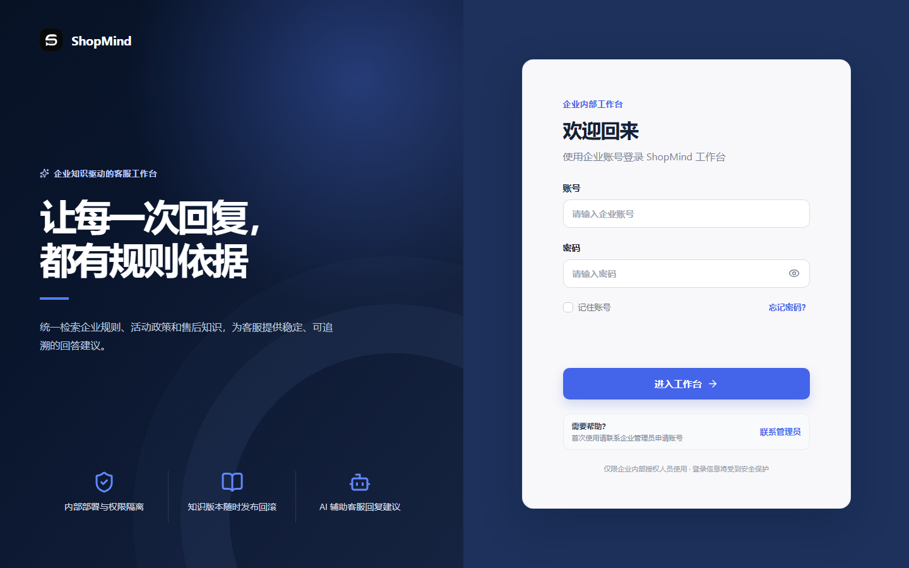
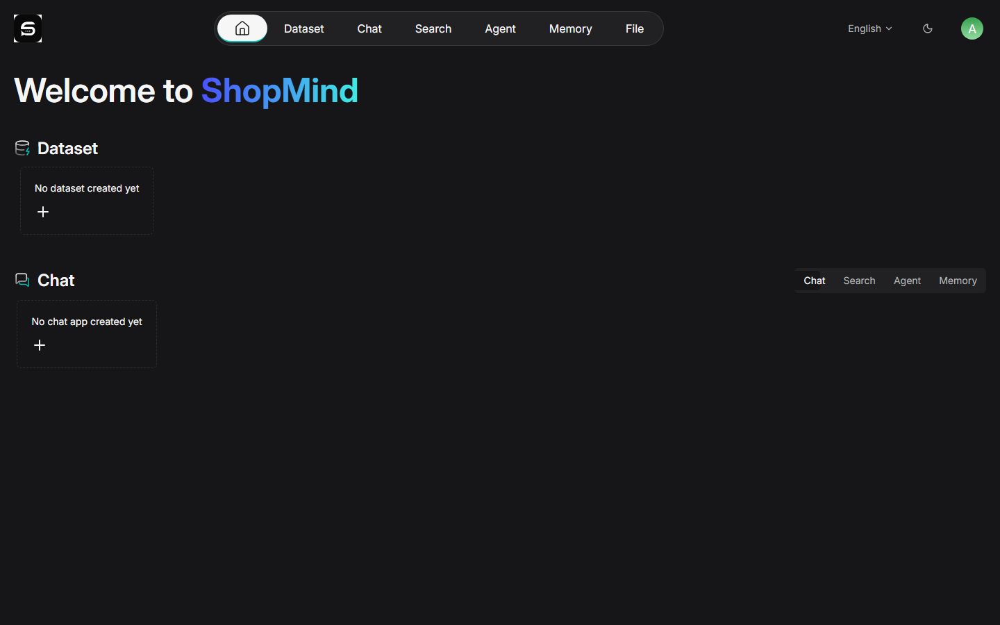

# ShopMind

ShopMind 是一个面向单企业内部使用的电商知识助手与客服工作台。它把产品层的知识库、版本发布、会话管理和回答体验，与 RAGFlow 的文档处理、检索、重排和模型编排能力连接起来，并通过 Redis 会话缓存和持久化审计记录提供可部署、可维护的工程基础。

> 当前版本用于学习、演示和企业内部原型验证，不接入真实订单、物流、退款或售后系统，也不包含真实客户隐私数据。

## 在线体验

**👉 打开即用：[https://oi1784105-spec.github.io/Shop-mind-/](https://oi1784105-spec.github.io/Shop-mind-/)**

登录页已经预填演示账号，直接点击「登录」即可走完整流程：

```text
登录 → 工作台总览（指标卡 + 最近知识库）
     → 知识中心：知识库 / 版本 / 文档，文档从「等待解析 → 解析中 → 已完成」
     → 文档全部完成后「发布当前版本」，版本原子切换为生效版本
     → 智能问答：选择参考知识库 → 提问 → 带回答依据的客服回复
     → 系统设置：服务状态与 RAGFlow API Key 配置
```

关于在线版需要说明的三点：

- 它是**纯静态演示版**，托管在 GitHub Pages 上，所有数据由浏览器本地生成，**不会调用 RAGFlow、Ollama 或任何模型服务**，也不需要 Docker。
- 演示数据保存在浏览器 localStorage 中，随时可以点顶栏的「重置」回到初始状态；重置后再进知识中心，可以看到文档解析状态重新从「等待解析」推进到「已完成」。
- 想要真实的知识库解析与检索能力，请按下方「快速部署」用 Docker Compose 起完整栈（RAGFlow + Redis + MySQL + MinIO + Ollama）。

## 预览

### ShopMind 产品登录页



### RAGFlow 内部运维入口



产品用户从 ShopMind 工作台完成知识问答和知识库管理；RAGFlow 页面仅作为 localhost 运维入口保留，用于模型供应商、底层数据集和服务状态管理。

## 核心能力

- 企业账号密码登录、Redis 会话缓存和基础权限隔离
- 多知识库选择，支持商品、活动、售后、物流等业务规则组合问答
- PDF、Word、HTML、Markdown、TXT、CSV、Excel 等文档上传
- 文档解析状态轮询、版本草稿、发布前完整性检查和原子切换
- 文档、知识库、版本和会话的新增、修改、删除能力
- RAGFlow 适配器边界：底层 API 变化不会直接泄漏到产品 API
- 保留 RAGFlow 原生多模型、多 Embedding、多数据库和文档引擎能力
- 管理员可在 ShopMind 设置页更新 RAGFlow 内部 API Key；密钥只在服务端保存并脱敏返回
- SQLite WAL 持久化业务数据，Redis 仅用于缓存和会话
- 健康检查脚本、审计日志、错误处理和自动化测试
- 企业级浅色工作台，并支持深色模式

## 架构

~~~mermaid
flowchart LR
  U[企业内部员工] --> WEB[ShopMind Web\\nReact + Vite]
  WEB --> API[ShopMind API\\nFastAPI]
  API --> REDIS[(Redis / Valkey\\n会话与缓存)]
  API --> DB[(SQLite\\n业务元数据与审计)]
  API --> ADAPTER[RAGFlow Adapter]
  ADAPTER --> RF[RAGFlow\\n文档解析 / OCR / 切分 / Embedding / 检索 / 重排 / 生成]
  RF --> OLLAMA[Ollama 本地模型]
  RF --> PROVIDERS[其他 RAGFlow 支持的模型供应商]
  OPS[内部运维入口] --> RF
~~~

ShopMind 不重复实现 RAGFlow 的文档处理服务。知识库版本在产品数据库中维护，只有当对应版本的文档全部完成解析后才允许发布；发布动作只切换 active version 指针，因此新版本索引期间旧版本仍可服务。

## 技术栈

| 层级 | 技术 |
| --- | --- |
| 产品前端 | React、TypeScript、Vite、Lucide React、Nginx |
| 产品后端 | Python 3.13、FastAPI、Pydantic、Uvicorn |
| 数据与缓存 | SQLite（WAL）、Redis/Valkey |
| RAG 引擎 | RAGFlow v0.27.0（vendor/ragflow） |
| 本地模型 | Ollama（当前部署默认，可由 RAGFlow 继续连接其他供应商） |
| 部署 | Docker Compose、Docker healthcheck |
| 在线演示版 | GitHub Pages、GitHub Actions、浏览器端接口模拟层 |

## 在线演示版是怎么做的

在线版没有后端，却要能完整体验产品，因此前端内置了一个**演示层**（`apps/shopmind-web/src/demo/`），在浏览器里接管全部接口调用。

| 问题 | 做法 |
|---|---|
| 后端跑不了 | FastAPI + Redis + RAGFlow 全栈无法托管在 GitHub Pages 上，因此只发布前端静态产物。 |
| 接口怎么来 | 前端所有请求都经过 `src/api.ts` 的 `request()`，因此**替换 `window.fetch` 就能整体接管**，视图代码一行都没有改动。 |
| 为什么必须返回 JSON 体 | `api.ts` 对任何 2xx 都会调用 `response.json()`：返回 204 或空体会抛 `SyntaxError`，让「操作成功了但界面报错」。因此演示层的删除、登出、创建版本等接口都返回 `{ "success": true }` 之类的 JSON。 |
| 错误怎么返回 | 前端只识别 `detail` 字段，因此所有异常都返回 `{ "detail": "..." }` 并带正确状态码（404 / 409 / 422）。 |
| 解析状态怎么模拟 | 文档状态由**时间戳**推导（`parse_starts_at` / `parse_ends_at`），而不是定时器：读取时按当前时间算出「等待解析 / 解析中 / 已完成」，这样刷新页面后状态依然正确。 |
| 轮询为什么必须用 RUNNING | 前端每 2.5 秒轮询文档列表，并且**只在 `DONE` / `3` / `FAIL` / `failed` 时停止**。因此进行中的文档必须返回 `RUNNING` 或 `UNSTART`，否则会出现永远轮询或状态不推进的问题。 |
| 发布门槛怎么对齐 | 前端与真实后端都要求**所有文档 `DONE`** 才允许发布；演示层同样校验，并把「解析失败」与「仍在解析」分开提示。 |
| 数据从哪来 | 预置 3 个知识库（含已发布与草稿两种状态）、多版本、按状态分布的文档与 3 段带回答依据的历史会话；新提问的回复按主题在本地生成，并明确标注为演示内容。 |

演示层实现分布在 6 个文件里，都不依赖 React，可单独测试：`index.ts`（fetch 垫片与路由）、`store.ts`（内存库与业务规则）、`content.ts`（预置数据与回答生成）、`types.ts`（数据结构）、`DemoBadge.tsx` / `demo.css`（顶栏演示标记）。

## 目录结构

~~~text
apps/
  shopmind-web/       # 独立产品前端
  shopmind-api/       # 独立产品 API、数据库、RAGFlow 适配器
deploy/ragflow/       # ShopMind 与 RAGFlow 的 Compose 覆盖配置
vendor/ragflow/       # RAGFlow 源码与本地定制层
data/samples/         # 虚拟演示规则文档
docs/screenshots/     # 脱敏后的项目截图
scripts/              # 健康检查与回归检查脚本
~~~

## 环境要求

- Windows 11、macOS 或 Linux
- Docker Desktop / Docker Engine，建议分配至少 8 GB 内存
- Git
- Ollama（如果使用本地模型），默认监听 http://127.0.0.1:11434
- PowerShell 7（Windows 执行检查脚本时推荐）

首次部署不需要安装 Node.js 或 Python；前后端依赖会在 Docker 构建阶段安装。仅在本地开发前端或后端时才需要对应运行时。

## 快速部署

### 1. 获取代码

~~~powershell
git clone https://github.com/oi1784105-spec/Shop-mind-.git
cd Shop-mind-
~~~

本仓库包含 RAGFlow 源码和产品层补丁，不依赖开发者本机路径。

### 2. 准备 RAGFlow 环境文件

RAGFlow 的运行参数必须保存在本机，不要提交到 GitHub。请先按照 vendor/ragflow/docker/README.md 和 vendor/ragflow/README_zh.md 配置完整的 MySQL、Redis、MinIO、文档引擎和镜像参数，然后将以下产品变量追加到 vendor/ragflow/docker/.env：

~~~dotenv
SHOPMIND_ADMIN_USERNAME=admin
SHOPMIND_ADMIN_PASSWORD=replace-with-a-strong-password
RAGFLOW_API_KEY=ragflow-your-api-key
RAGFLOW_ADMIN_NO_LOGIN=true
RAGFLOW_DEFAULT_LLM_ID=
RAGFLOW_DEFAULT_EMBEDDING_MODEL=
SHOPMIND_WEB_PORT=8080
SHOPMIND_API_PORT=8000
RAGFLOW_OPS_HTTP_PORT=8081
~~~

示例配置位于 deploy/ragflow/.env.shopmind.example。所有密码和密钥都必须替换为自己的强随机值。

### 3. 启动

~~~powershell
docker compose -p ecommerce-ragflow --env-file vendor/ragflow/docker/.env -f vendor/ragflow/docker/docker-compose.yml -f deploy/ragflow/docker-compose.local.yml up -d --build
~~~

启动完成后访问：

- ShopMind 产品工作台：<http://127.0.0.1:8080>
- ShopMind API：<http://127.0.0.1:8000>
- RAGFlow 内部运维入口：<http://127.0.0.1:8081>
- RAGFlow API：<http://127.0.0.1:9380>

### 4. 验证服务

~~~powershell
./scripts/test-shopmind.ps1
./scripts/test-ragflow.ps1
docker compose -p ecommerce-ragflow ps
~~~

### 在线演示版（GitHub Pages）

演示版由 [`.github/workflows/deploy-pages.yml`](.github/workflows/deploy-pages.yml) 自动构建发布：推送到 `main` 且改动涉及前端时触发，也可以在 Actions 页面手动运行。

```bash
cd apps/shopmind-web
npm ci
npm run type-check
npm run build:demo     # 等价于 vite build --mode demo
```

构建参数放在 `apps/shopmind-web/.env.demo` 中，本地与 CI 使用同一份配置：

| 变量 | 作用 |
|---|---|
| `VITE_DEMO_MODE` | 打开演示模式，由浏览器本地的模拟层接管全部接口 |
| `VITE_BASE` | 发布子路径，Pages 项目站点需要 `/<repo>/`（本仓库为 `/Shop-mind-/`） |

子路径部署依赖三处配合，缺一会白屏或链接跳出：

1. `vite.config.ts` 的 `base`（由 `VITE_BASE` 驱动）——否则 `/assets/...` 会 404；
2. `main.tsx` 中 `BrowserRouter` 的 `basename`——否则站内链接会跳到站点根目录；
3. `public/` 下的静态资源通过 `import.meta.env.BASE_URL` 拼接（`App.tsx` 的 `assetUrl()`）——否则 logo 会 404。

流水线会把 `index.html` 复制为 `404.html`，使直接访问 `/knowledge` 这类前端路由时也能正常回退到应用。要让同一个代码库连真实后端，只要不带 demo 模式构建（`npm run build`）即可。

## 首次使用流程

1. 打开 http://127.0.0.1:8080，使用 .env 中的管理员账号登录。
2. 在“知识中心”创建知识库，例如“商品与售后规则”。
3. 创建或选择草稿版本，上传 data/samples/ 中的虚拟 Markdown 规则文档。
4. 等待文档状态从“解析中”变为“已完成”。
5. 发布版本；系统会在所有文档处理完成后才允许发布，并保留旧版本可用性。
6. 进入“智慧问答”，选择一个或多个知识库作为参考，发送商品、活动或售后规则问题。
7. 在“设置”中查看 RAGFlow 连接状态。管理员可更新以 RAGFlow 开头的内部 API Key；页面不会回显完整密钥。

## 配置说明

### 模型与 Embedding

Ollama 是当前本地默认模型服务。请先在宿主机启动 Ollama，并在 RAGFlow 运维入口配置聊天模型和 Embedding 模型。ShopMind 只通过 RAGFlow Adapter 调用模型，因此不会把系统限制为 Ollama：RAGFlow 支持的其他云端或私有化供应商仍可在运维入口配置和切换。

容器访问 Windows 宿主机 Ollama 使用 http://host.docker.internal:11434。

### RAGFlow API Key

产品设置页更新的密钥会同步写入挂载的 vendor/ragflow/docker/.env 中的 RAGFLOW_API_KEY，并立即更新 ShopMind API 进程内客户端。密钥不会写入业务数据库、浏览器存储或日志。生产环境建议通过受控密钥管理系统挂载环境文件，并限制文件权限。

## 文档与知识库版本

- 支持格式：PDF、DOC/DOCX、HTML、Markdown、TXT、CSV、XLS/XLSX。
- 图片、扫描 PDF、表格等复杂内容由 RAGFlow 的 DeepDoc/OCR/表格解析链路处理。
- 每个知识库拥有独立版本；文档上传到草稿版本后异步解析。
- 版本发布采用完整性检查和原子 active pointer 切换。
- 删除知识库、版本或文档时，产品元数据与 RAGFlow 对象按顺序清理，失败会记录审计信息。

## 常见问题

### 页面能打开但一直加载

先执行 docker compose -p ecommerce-ragflow ps，确认 shopmind-api、ragflow-cpu、redis、mysql、es01 和 minio 状态正常，再查看：

~~~powershell
docker compose -p ecommerce-ragflow logs --tail=200 shopmind-api ragflow-cpu
~~~

### 无法创建知识库或上传文档

确认 RAGFLOW_API_KEY、RAGFLOW_SHOPMIND_TENANT_ID 和 RAGFlow 数据服务已配置；使用 scripts/test-ragflow.ps1 检查 db、doc_engine、redis 和 storage 均为 ok。

### Ollama 请求超时

确认宿主机 Ollama 正在运行、模型已下载，并将 RAGFlow 的模型地址设置为 http://host.docker.internal:11434。可适当降低并发和上下文长度，或在 RAGFlow 运维入口切换到已配置的其他模型供应商。

### 停止服务

~~~powershell
docker compose -p ecommerce-ragflow --env-file vendor/ragflow/docker/.env -f vendor/ragflow/docker/docker-compose.yml -f deploy/ragflow/docker-compose.local.yml down
~~~

不要随意加 -v；那会删除本地 RAGFlow 数据卷。

## 安全与隐私

- 绝不提交 vendor/ragflow/docker/.env、数据库、日志、缓存、模型文件或真实业务数据。
- 首次启动必须设置强管理员密码，不要依赖代码默认值。
- 真实订单、物流、退款和客户隐私不属于当前版本范围；接入前应增加租户隔离、字段脱敏、最小权限和审计策略。
- 生产环境应将服务绑定在内网或反向代理后，不要直接暴露 RAGFlow 管理端口。
- 产品层会对供应商和模型返回值做敏感字段脱敏，但不替代基础设施级密钥管理。

## 开源与上游声明

vendor/ragflow 来源于 RAGFlow，并保留其 LICENSE、版权声明和上游目录结构。RAGFlow 及其依赖的许可证应以各自目录中的许可证文件为准；发布二次开发版本时请同时遵守 Apache-2.0 和第三方依赖的 NOTICE/版权要求。ShopMind 产品层代码与品牌为本项目内容，未授权复制 ShopMind 品牌、Logo 或默认界面。

## 当前限制与后续方向

- 当前首期只面向单企业内部使用。
- 不连接真实订单、物流、退款或售后系统，回答依据仅来自上传的企业规则文档。
- 当前业务元数据默认使用 SQLite，规模化部署可迁移到企业数据库，同时保留 RAGFlow 自身数据库能力。
- 后续可增加 SSO、细粒度 RBAC、评估集、回答质量监控、知识库定时同步和多租户隔离。

## License

本仓库未为 ShopMind 产品层单独声明新的开源许可证；如需二次分发或商业化，请先确认项目维护者授权，并同时遵守 vendor/ragflow/LICENSE 及所有第三方依赖许可证。
